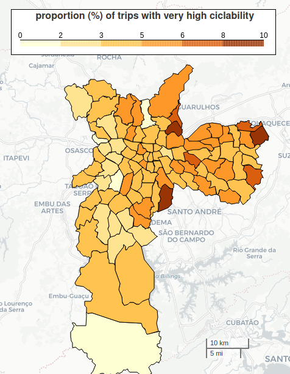
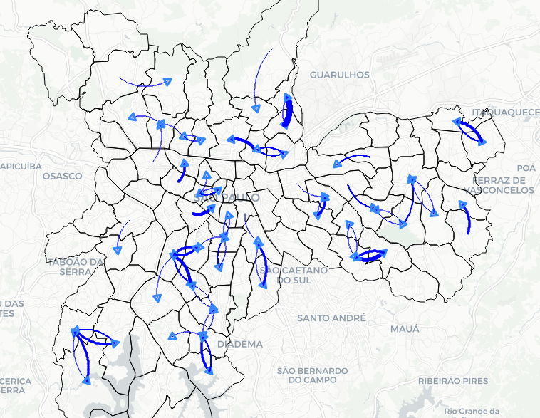
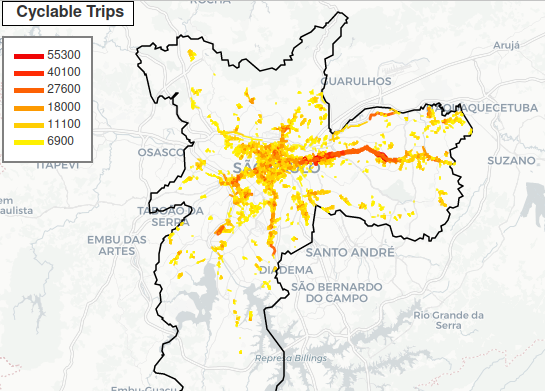
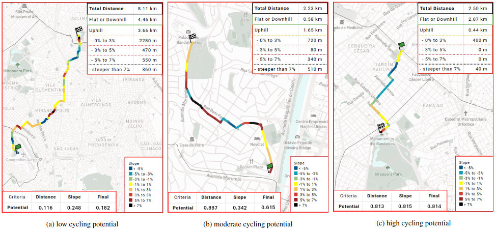

# SP Cycling Potential

This repository contains the code and other resources of the Cycling Potential Index (name to be redefined). It is part of the [BikeScience Project](https://gitlab.com/interscity/bike-science/).

Transport authorities and mobility researchers can use our model to discover regions (streets or districts) with high demand and proper conditions to cycling (**cycling potential**). 

Published Paper: [(in progress)]()

## ⚙️ Jupyter Notebooks 

The code developed in this work is open-source and was built in Jupyter Notebooks, with Python programming language, and the libraries of pandas, geopandas and folium to manipulate dataframes and georeferenced data.

These notebooks are in the `src` directory and have numerical prefix indicating the order in which they were developed.
You should probably execute them in such order.

**`./src`** contents:
- **`0_OD_Analysis.ipynb`**: uses OD17 data to study the cyclists profiles
- **`0a_OD_bike_x_vehicles.ipynb`**: uses OD17 data to compare distinct modals' trips and users
- **`1_Cycling_Potential_Variables.ipynb`**: deepens the previous analysis for the variables that were relevant for the model
- **`2_Cycling_Potential_Processing.ipynb`**: calculates the cycling potential for all trips - generates the `complete_csv.csv` file 
- **`3_Cycling_Potential_Regression.ipynb`**: studies the relation among the variables and the use of bicycle
- **`4_Cycling_Potential_Examples.ipynb`**: contains code to select trips and analyse their routes, characteristics, and cycling potential
- **`5_Cycling_Potential_Validation.ipynb`**: performs validations to perceive the model's consistensy - including comparisons with topological data with and among bicycle and non-bicycle trips
- **`6_Cycling_Potential_Choropleths.ipynb`**: generates choropleth maps with the distribution of cyclable trips in São Paulo1s districts 
- **`7_Cycling_Potential_Flows.ipynb`**: generates flows maps (aggregation of trips) 
- **`8_Cycling_Potential_Lanes_Processing.ipynb`**: executes the geoprocessing responsible for calculating the number of cyclable trips in each street of São Paulo
- **`9_Cycling_Potential_Lanes_Maps.ipynb`**: aggregates the processing of the previous notebook and displays it in form of maps (showing the number of trips in each lane).
- **`10_Cycling_Potential_Planning.ipynb`**: applies our cycling potential model (counting the cyclable trips) to the municipal planning for bicycle lanes expansion
- **`11_Generic_Routes.ipynb`**: calculates the cycling potential of any route (given origin and destination address)
- **`12_Potential_Table.ipynb`**: extracts data (in a table) regarding the distribution of ciclability among all trips of each modal

There are also some auxiliar Jupyter Notebooks in the `extra notebooks` folder. They were used to investigate parallel information during the development of this work.

## 🗺️ Maps 

In the Jupyter Notebooks, it is possible (and easy) to generate customized maps with specific filters. 

The maps are show in the notebooks, and we save them in the `src/maps` folder in html files.  

### Examples of maps

- Choropleths (generated by the notebook 6):

- Flows (generated by the notebook 7):

- Streets (generated by the notebook 8):

## 🚴‍♂️ Trips Example

